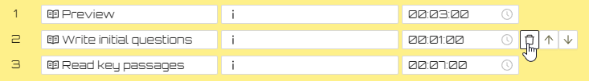
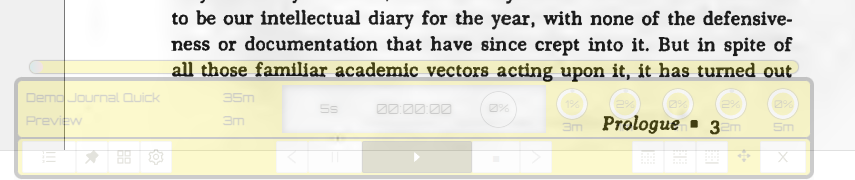
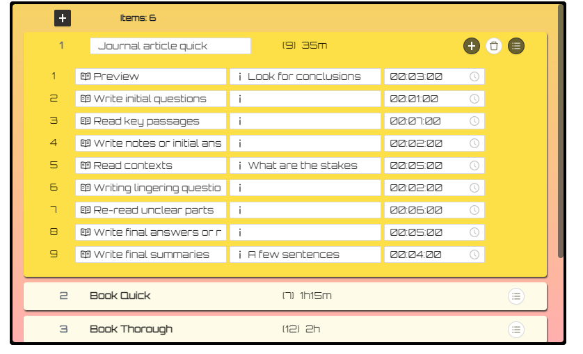
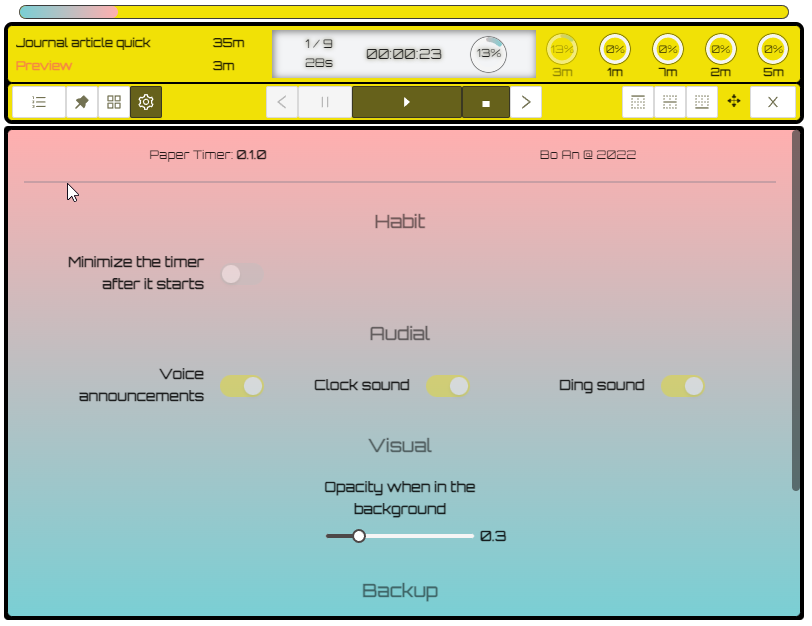

# Why [Paper Timer](https://www.papertimer.com)

Paper timer makes your reading more efficient and stress-free.

It's more than a timer to track time; it's a simple and yet powerful tool to let you experiment with methods of reading that suit you and turn them into habits.

See:

- [__design philosophy__](#design-philosophy) to learn more about why Paper Timer is different.
- [__example item__](#example) to see to utilize the `stages` and `items` to help you read.
- [__use cases__](#usages) a list of scenarios where Paper Timer can help you.
- [__inspirations__](#inspirations) for works that shaped the conceptualization of the timer.
- [__FAQ__](#faq) for common and not-so-common questions.
- [__possible issues__](#possible-issues) to learn about known issues.
- [__support__](#support) if you like and want to support Paper Timer
- [__change log__](#changelog) for changes.

 
---

# Download

## Windows

- Latest version
  - [0.1.1, 2022-07-21](https://github.com/boan-anbo/paper-timer-public/releases/download/v0.1.1/Paper.Timer_0.1.1_x64_en-US.msi)

## Mac

- Latest version:
  - [0.1.1, 2022-07-21](https://github.com/boan-anbo/paper-timer-public/releases/download/v0.1.1/Paper.Timer_0.1.1_universal.dmg)
    - Universal version, notarized.
    - For Mac with Intel or Apple Silicon chip.

## Linux

- Upcoming

---

# Usages

Some typical scenario where using Paper Timer makes a difference:

1. __literature review__
    - where you need to go through many readings quickly and multiple times: the first time you filter out relevant ones by scanning them, and the second time you read the important items more thoroughly etc..

2. class __reading assignments__

    - When you have to read _x_ number of books in _y_ amount of time.

3. Ph.D comprehensive __exam__ preparation.

    - A combination of the above two and more intense.

4. Routine news or journal __reading sessions__ to keep up with the art of the field.

    - You have 2 hours to spend in the morning. How many things can you read?

5. Train yourself to __be a better reader__

    - Trying different reading strategies that work for you, implemented as configurations of stages and items, and __form good reading habits__.

Check out the demo item below (coming with Paper Timer), experiment with your own, and make changes to your `stages` as you use the timer.

---

# Features

- Easy reading `item` and `stage` organizations. See [terms](#terms) section for their definition.

- Extremely helpful voice notifications of reading progresses. If you don't like them, you can mute it in [settings](#configurations).
  - But I strongly recommend keeping them on, so you don't have to check Paper Timer and can keep it minimized and focus on the reading.
- Pleasant sound effects for background and stage and item endings. Differential clock sound let you easily know where you are and how much time left. Also mutable.

- Easily stick to the top or bottom of the screen while you're reading.

- Unobtrusive: becomes half transparent automatically when you're reading on the screen.

- And more in [roadmap](#roadmaps).

---

# Example

- A demo item called `Demo Journal Quick` is included in the Paper Timer. You can get a sense what a typical item with its stage arrangement should look like.
  - The reading is divided into four phases:
    1. `preview`
    2. `reading key passages`
    3. `and reading contexts` and
    4. `re-reading unclear parts`.

  - The reading phases are separated from each other with writing stages, where you write your questions, thoughts. These are also moments for reflections.

  - The second column is for notes or remainders about what this stage is supposed to do. For example, for the `preview` stage, you should "look for conclusions" etc.

  - Remember to include key words in your item name, `Journal article quick` in this case, to indicate both
    - the nature of the item ("journal article") and
    - the method ("quick").

---

# Design philosophy

The design philosophy of Paper Timer holds true three principles about reading:

## _Iterate_: read it multiple times

- Reading the same material multiple times, __each time focusing on different tasks__, is _better_ than reading in one go and from cover to cover, which is always the worst way to read academic literature even if you have the time, unless you're reading pure narratives.

## _Be selective_: focus on key parts

- Reading is an never ending process. You can turn the necessary incompleteness to a positive selectivity by __reading the key parts actively within time limits__.

## _Space_: leave time to reflect and write

- __Reading with questions__ makes active reading easier. Starting to write down thoughts, especially questions, during the reading process, not after, will increase dramatically increase your comprehension.

---

# Terms

Item
: __An item to read using a certain method.__

: E.g., a reading item could be a journal article, or a section of a paper you want to write.

: However, an item in Paper Timer also means _a method or a situation_.

: Sometimes you want to skim an article, sometimes you want to read thoroughly, and sometimes you are pressed with time but still want to take most our of the article with all the time you have. The __"situation"__ is crucial for item.

: E.g., for an average journal article, say 25-45 pages, you can create three `items`: (1) an item called "Journal article scanning" (which takes 2 `stages` and 5 minutes to read in total), (2) "Journal article close reading" (which takes 6 `stages` and 40 minutes), and (3) "Journal article fast reading (which also takes 6 `stages` but only 25 minutes).

Stage
: __A step in an [`item`](#terms). Ideally, should focus on only one task.__
: E.g. during the "previewing" `stage`, look only for the central argument; and then during the "reading for evidence" `stage`, try to identify the key evidence the author provided for the previous argument.

---

# Configurations

- You can adjust the setting and export and import user data in `settings`.

---

# Inspirations

It's been many years since I started to use similar practices in my reading. The inspirations are many and many of their ideas are reflected in the Paper Timer. This is no ads--no referral links or anything, just recommendations and acknowledge..

1. [How to Read](https://pne.people.si.umich.edu/PDF/howtoread.pdf) a Book by [Paul Edwards](https://cisac.fsi.stanford.edu/people/paul-n-edwards)

- A super useful and succinct guide for academic reading.

- Download the [pdf guide](https://pne.people.si.umich.edu/PDF/howtoread.pdf) here.
  
2. Andrew Abbott's [_Digital Paper_](https://press.uchicago.edu/ucp/books/book/chicago/D/bo18508006.html)

- An original and comprehensive guide not just on reading but on doing library-based research in general.

3. [How to Read a Book: The Classic Guide to Intelligent Reading](https://www.amazon.com/How-Read-Book-Classic-Intelligent/dp/0671212095) by  Mortimer J. Adler and Charles Van Doren

- A classic on reading methods. Read this as an undergrad and it changed my life. A bit dated and geared more towards general readers but still extremely useful and inspiring.

4. [The Power of Reading: Insights from the Research](https://www.amazon.com/Power-Reading-Insights-Research-2nd/dp/1591581699) by Stephen Krashen

- A classic on language acquisition through free voluntary reading--Not exactly the same as the kind of targeted and controlled reading promoted by Paper Timer though.

---

# FAQ

## Q: Is Paper Timer a productivity tool? How is it different from popular productivity timers such as Pomodoro timers or time trackers

- Yes and no! One lesson I learned from my academic studies is that, when it comes to Research software, a lot of things are missing in common productivity tools. A generic tool is OK for everyone but great for no one.
Compared to Pomodoro timers and focus trackers, for example, Paper Timer allows you not only to decide __how much__ time you will spend, but also __how__ you will spend them, stage by stage.
The difference seems small but the implication is huge. My best advice is try using Paper Timer and Pomodoro for reading and feel the difference by yourself. You'll love it.

## Q: What do you mean by "Paper Timer makes you stress-free"?

- When you have to finish 12 articles in 6 hours, if you're not carefully, you can easily overspend time on some of the readings and leave others little time to go over. You _will_ be stressed, not knowing how much time you should spend on each and not knowing when you will finish. Using Paper Timer will not make these problems magically disappear, but trust me it will make reading so much more enjoyable and it incredibly easy to focus even when you have hard deadlines ahead.

## Q: Is Paper Timer free?

- Yes. I was tempted to charge a small amount of fee for Mac users because Apple charges me $99 a year just to allow me to notarize it; but I decided against it. I might consider donation options later.

## Q: Is Paper Timer great for all reading scenarios?

- Absolutely not.
  In my years of using timers of this kind which I built, I often found scenarios where I need to pause the timer, so I can spend more time on something until I'm ready to move on, rather than following the predefined stages. And sometimes, especially after you have internalized the staged reading techniques, you might be even more productive reading without Paper Timer. Paper Timer shouldn't be a prison house; it's a scaffold.

## Q: What's background sound?

- It's a free sound recording of a summer night in a Japanese temple.

## Q: What's the ding sound?

- The "ding" sound you hear at the end of an item--after all stages have ended--is the sound of a Tibetan singing bowl. Soothing huh?

---

# Possible issues

- If you toggle the profile view (the first button to the left) while the timer is running, there is a chance the timer is stuck. Restart the timer solves the issue.

---

# Bugs and features

If you encounter bugs or want to suggest features, please use the [issues](https://github.com/boan-anbo/paper-timer-public/issues).

---

# Support

Paper Timer is __free__. If you hope to support the development, you can

1. report bugs and make suggestions using the [issues](https://github.com/boan-anbo/paper-timer-public/issues).
2. spread the word and recommend Paper Timer to others!

---

# Roadmaps

- [ ] Multi-lingual support
- [ ] Multiple profiles
- [ ] Linux version
- [ ] Quick note

---

# Changelog

## [0.1.1] - 2022-07-21

### Added

- Demo item to help new users to get familiar with using `stages`.
- Universal app for Mac users.
- Adjusted stage information display for make it easier to tell the current item and stages.
- Option to clear user data and reset.

## [0.1.0] - 2022-07-19

- First release

...

## [0.0.1] - 2016-01-11

- I built the first prototype of this timer the second semester in graduate school. Some of the sound you hear in the current version, such as the background and ticking sounds are from back then. I can write about the evolution of this timer in relation to my study at a later point.

<!-- # Personal history

I started writing my first timer of this nature a few months into my doctoral study. The coursework was intense. It's a humanities program which tends to assign more readings than most of other disciplines. On the heavier side, one course could assign two to three books every week; even the lighter courses would expect four to six readings at least for each session. And we take 3-5 courses each semester. So it averaged about  800 to 1,200 pages per week.

I know it's known fact in graduate school that there is the survival strategy which says you _don't_ read everything assigned but only those that can give you something to write and talk about for the next class. But I didn't believe in that, except for a few obligatory courses that I had to take as part of the degree requirements but was not interested in. For all the courses I picked myself, I, like any nerd in the graduate school, wanted to read _everything_ assigned and more (the person, the history, debate contexts, reviews etc). Of course, it was unrealistic to do all these with the limited time I had.

From this, I learned that (1) I absolutely need a timer to make sure I won't spend more time than I should reading one material, however much I enjoyed it, at the expanses of the others, and (2) I have to read smartly, which I didn't really know how to until after my comprehensive exam.

The first timer I built look like this: -->
