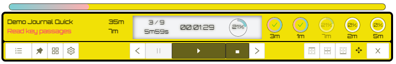

# Why Paper Timer

You can use the [editor on GitHub](https://github.com/boan-anbo/paper-timer-public/edit/gh-pages/index.md) to maintain and preview the content for your website in Markdown files.

Whenever you commit to this repository, GitHub Pages will run [Jekyll](https://jekyllrb.com/) to rebuild the pages in your site, from the content in your Markdown files.

# Download

## Windows

- [Latest version, 0.1.0, 2022-07-19](https://github.com/boan-anbo/paper-timer-public/releases/download/0.1.0/Paper-timer_0.1.0_x64_en-US.msi)

## Mac

- Upcoming
  
# How to use the timer

