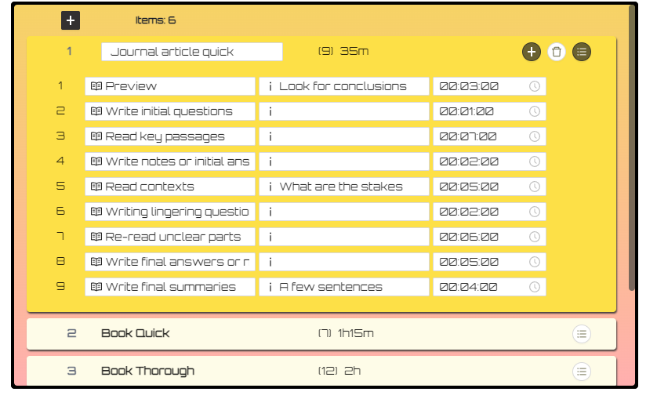

# Why Paper Timer

Paper timer makes your reading and writing more efficient and stress-free.

It's more than a timer to track time; it's a simple and yet powerful tool to let you experiment with methods of reading and writing that suit you and turn them into habits.

See:

- [__design philosophy__](#design-philosophy) to learn more about why Paper Timer is different.
- [__example item__](#example) to see to utilize the `stages` and `items` to help you read.
- [__use cases__](#usages) a list of scenarios where Paper Timer can help you.

---

# Download

## Windows

- Latest version
  - [0.1.1, 2022-07-21](https://github.com/boan-anbo/paper-timer-public/releases/download/v0.1.1/Paper.Timer_0.1.1_x64_en-US.msi)

## Mac

- Latest version:
  - [0.1.1, 2022-07-21](https://github.com/boan-anbo/paper-timer-public/releases/download/v0.1.1/Paper.Timer_0.1.1_universal.dmg)
    - Universal version, notarized.
    - For Mac with Intel or Apple Silicon chip.

## Linux

- Upcoming

---

# Usages

## 1. Typical usages include When you have to read _x_ number of books in _y_ amount of time

- literature review
- class reading assignments
- daily journal reading
- Ph.D comprehensive exam preparation.

## 2. When you want to become a better reader by trying different strategies, implemented as configurations of stages and items

- Check out the demo item below (coming with Paper Timer), experiment with your own, and make changes to your `stages` as you use the timer.

---

# Example

- A demo item called `Demo Journal Quick` is included in the Paper Timer. You can get a sense what a typical item with its stage arrangement should look like.
  - The reading is divided into four phases:
    1. `preview`
    2. `reading key passages`
    3. `and reading contexts` and
    4. `re-reading unclear parts`.

  - The reading phases are separated from each other with writing stages, where you write your questions, thoughts. These are also moments for reflections.

  - The second column is for notes or remainders about what this stage is supposed to do. For example, for the `preview` stage, you should "look for conclusions" etc.

  - Remember to include key words in your item name, `Journal article quick` in this case, to indicate both
    - the nature of the item ("journal article") and
    - the method ("quick").

---

# Design philosophy

The design philosophy of Paper Timer holds true three principles about reading and writing.

## _Iterate_: read it multiple times

- Reading the same material multiple times, __each time focusing on different tasks__, is _better_ than reading in one go and from cover to cover.

## _Be selective_: focus on key parts

- Reading is an never ending process. You can turn the necessary incompleteness to a positive selectivity by __reading the key parts actively within time limits__.

## _Space_: leave time to reflect and write

- __Reading with questions__ makes active reading easier. Starting to write down thoughts, especially questions, during the reading process not after helps tremendously

---

# Terms

Item
: __An item to read and write using a certain method.__

: E.g., a reading item could be a journal article, or a section of a paper you want to write.

: However, an item in Paper Timer also means _a method or a situation_. 

: Sometimes you want to skim an article, sometimes you want to read thoroughly, and sometimes you are pressed with time but still want to take most our of the article with all the time you have. The __"situation"__ is crucial for item.

: E.g., for an average journal article, say 25-45 pages, you can create three `items`: (1) an item called "Journal article scanning" (which takes 2 `stages` and 5 minutes to read in total), (2) "Journal article close reading" (which takes 6 `stages` and 40 minutes), and (3) "Journal article fast reading (which also takes 6 `stages` but only 25 minutes).

Stage
: __A step in an [`item`](#terms). Ideally, should focus on only one task.__
: E.g. during the "previewing" `stage`, look only for the central argument; and then during the "reading for evidence" `stage`, try to identify the key evidence the author provided for the previous argument.

---

# Configurations

- You can adjust the setting and export and import user data in `settings`.

---

# Bugs and features

If you encounter bugs or want to suggest features, please use the [issues](https://github.com/boan-anbo/paper-timer-public/issues).

---

# Support

Paper Timer is __free__. If you hope to support the development, you can 
1. __report bugs and make suggestions__ using the [issues](https://github.com/boan-anbo/paper-timer-public/issues). 
2. __spread the word__ and recommend Paper Timer to others.
---

# Changelog

## [0.1.1] - 2022-07-21

### Added

- Demo item to help new users to get familiar with using `stages`.
- Universal app for Mac users.
- Adjusted stage information display for make it easier to tell the current item and stages.
- Option to clear user data and reset.

## [0.1.0] - 2022-07-19

- First release

<!-- # Personal history

I started writing my first timer of this nature a few months into my doctoral study. The coursework was intense. It's a humanities program which tends to assign more readings than most of other disciplines. On the heavier side, one course could assign two to three books every week; even the lighter courses would expect four to six readings at least for each session. And we take 3-5 courses each semester. So it averaged about  800 to 1,200 pages per week.

I know it's known fact in graduate school that there is the survival strategy which says you _don't_ read everything assigned but only those that can give you something to write and talk about for the next class. But I didn't believe in that, except for a few obligatory courses that I had to take as part of the degree requirements but was not interested in. For all the courses I picked myself, I, like any nerd in the graduate school, wanted to read _everything_ assigned and more (the person, the history, debate contexts, reviews etc). Of course, it was unrealistic to do all these with the limited time I had.

From this, I learned that (1) I absolutely need a timer to make sure I won't spend more time than I should reading one material, however much I enjoyed it, at the expanses of the others, and (2) I have to read smartly, which I didn't really know how to until after my comprehensive exam.

The first timer I built look like this: -->
